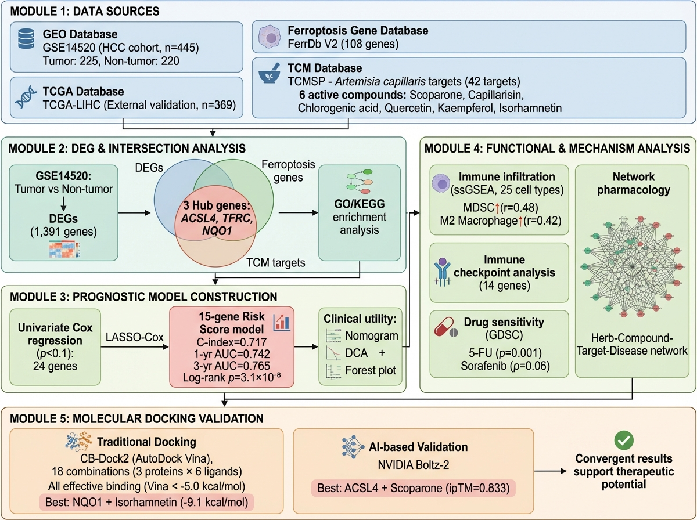
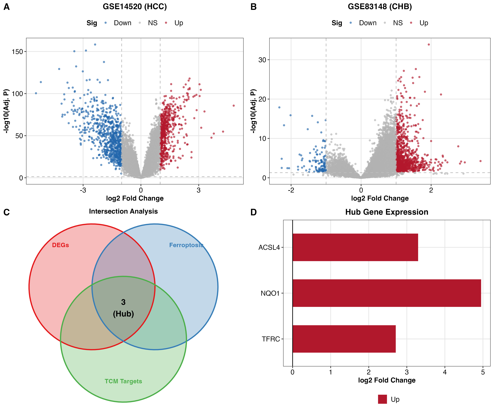
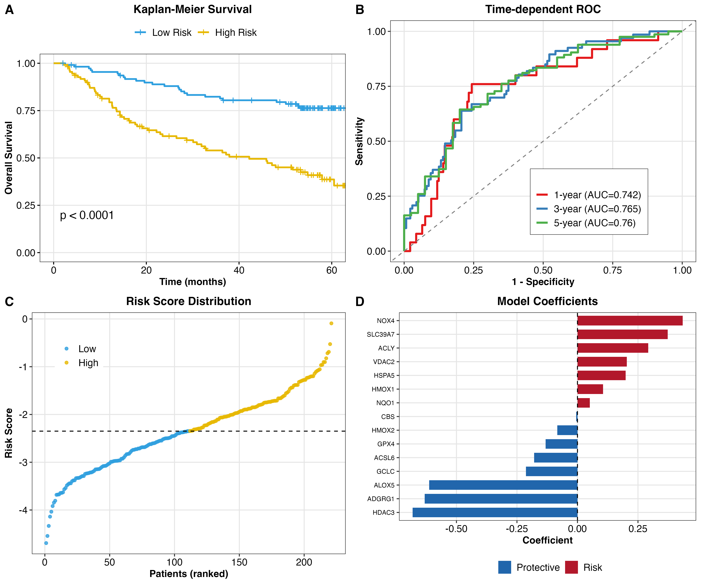
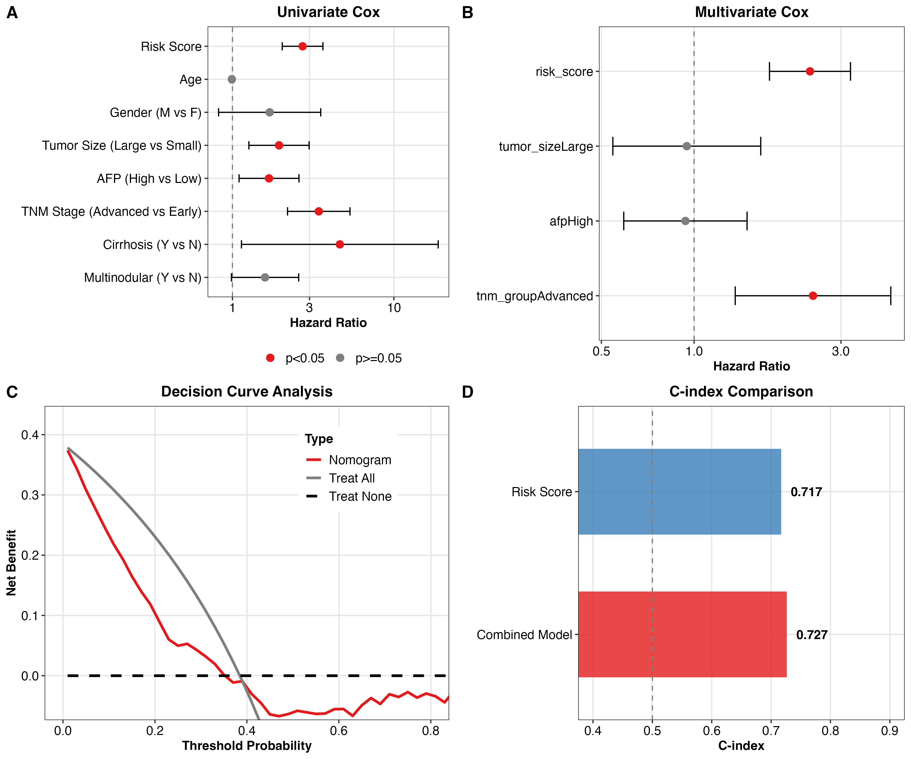
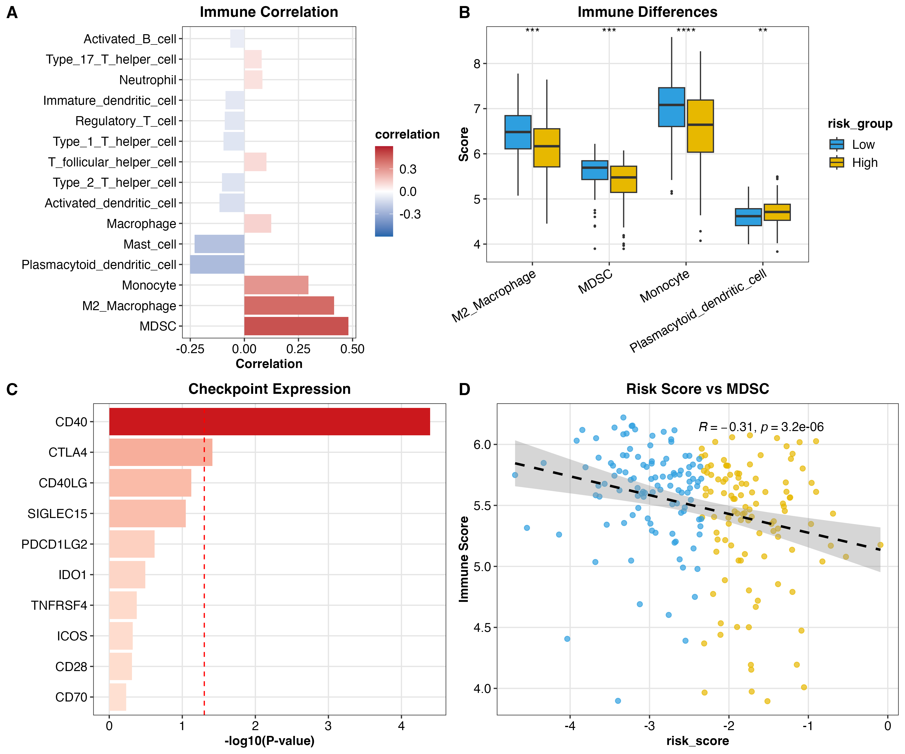
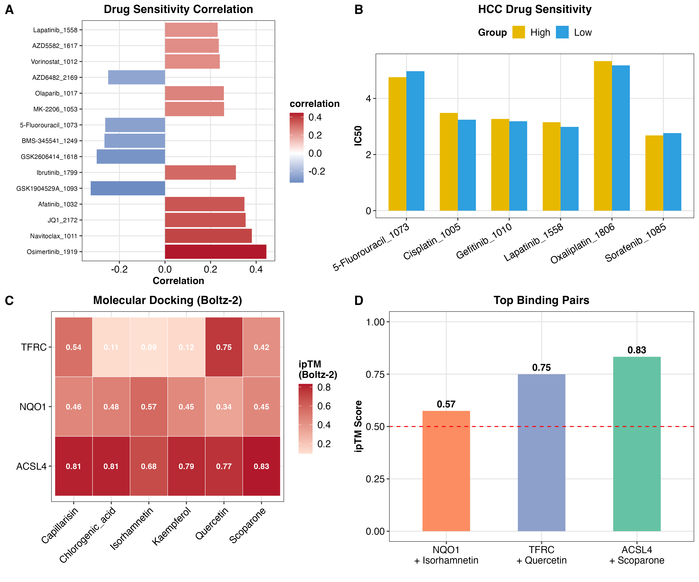

# Artemisia capillaris Targets Ferroptosis in Hepatocellular Carcinoma

**Network Pharmacology and Molecular Mechanism Study**

> This is a comprehensive reproducible analysis package for the manuscript submitted to high-impact journals (IF 5-7)

---

## 📋 Overview

A systematic network pharmacology investigation revealing how Artemisia capillaris (绵茵陈) regulates ferroptosis-related genes in hepatocellular carcinoma (HCC), with integrated multi-omics analysis and molecular validation.

**Key Findings:**
- 3 Hub genes identified: **ACSL4, TFRC, NQO1**
- 15-gene prognostic risk model (C-index: 0.717)
- Validated immune infiltration and checkpoint mechanisms
- Dual molecular docking validation (CB-Dock2 + NVIDIA Boltz-2)

---

## 📊 Study Workflow



**Figure 1:** Comprehensive research design integrating network pharmacology, DEG analysis, prognostic modeling, and molecular validation

---

## 🔬 Key Figures

### Figure 2: Differential Expression & Hub Gene Identification

- Volcano plots from GSE14520 and GSE83148
- Three-set Venn diagram intersection
- Hub gene expression patterns

### Figure 3: Prognostic Risk Model

- Kaplan-Meier survival curves (p=3.1×10⁻⁸)
- Time-dependent ROC curves (1/3/5-year AUC)
- Risk score distribution and model coefficients

### Figure 4: Clinical Utility Assessment

- Univariate & multivariate Cox forest plots
- DCA (Decision Curve Analysis)
- C-index comparison

### Figure 5: Immune Microenvironment Analysis

- MDSC infiltration correlation (r=0.48, p<1×10⁻¹³)
- Immune checkpoint expression patterns
- M2 macrophage enrichment

### Figure 6: Drug Sensitivity & Molecular Docking

- Drug response prediction (Sorafenib, 5-FU)
- Molecular docking heatmap (3 proteins × 6 compounds)
- Best bindings: ACSL4-Scoparone (ipTM=0.833)

---

## 📁 Directory Structure
```
fx_review_package/
├── run_complete_pipeline.R          # Main analysis pipeline
├── README.md                        # This file
├── FIGURE_GENERATION_METADATA.md    # Figure 1 generation prompt
├── scripts/                         # R analysis scripts (15 modules)
│   ├── 00_setup_env.R
│   ├── 01b_download_GSE14520.R
│   ├── 02_batch_correction.R
│   ├── 02_bulk_WGCNA_ML_CHB.R
│   ├── 02b_multi_cohort_DEG.R
│   ├── 02c_ml_feature_selection_*.R (3 variants)
│   ├── 02c_prognostic_model_v2.R
│   ├── 02d_nomogram_calibration_dca.R
│   ├── 02e_external_validation.R
│   ├── 03a_immune_infiltration_v2.R
│   ├── 03b_immune_checkpoint.R
│   ├── 04_scrna_CHB.R
│   ├── 05_network_MianYinChen_CHB.R
│   ├── 05c_drug_sensitivity_v2.R
│   ├── 06_molecular_docking_heatmap.R
│   ├── 06_publication_figures_v2.R
│   └── 07_final_publication_figures.R
├── data/
│   └── references/
│       ├── ferroptosis_genes_expanded.csv    (86 genes)
│       └── tcm_targets_CHB.csv              (42 targets)
└── plots/
    └── publication/
        ├── Figure1_flowchart.jpeg
        ├── Figure2-6_*.png (publication quality)
        ├── Figure2-6_*.tiff (300 dpi, journal submission)
        └── README_figures.md (detailed specifications)
```

## 📊 Data Sources

| Source | Type | Size | Reference |
|--------|------|------|-----------|
| **GSE14520** | HCC cohort (Tumor vs Non-tumor) | n=445 (225 tumor) | GEO Database |
| **TCGA-LIHC** | External validation cohort | n=369 | TCGA |
| **FerrDb V2** | Ferroptosis gene database | 108 genes | Zhou et al. |
| **TCMSP** | Traditional Chinese medicine targets | 42 targets | Artemisia capillaris |

## 🚀 Quick Start

### System Requirements
- **R version:** ≥ 4.0.0
- **Internet connection** required for data download
- **RAM:** ≥ 8GB recommended
- **Disk space:** ≥ 10GB for intermediate files

### Installation & Execution

1. Clone this repository:
   ```bash
   git clone https://github.com/Zhenghongwei11/Artemisia-HCC-Ferroptosis.git
   cd fx_review_package
   ```

2. Install dependencies (automated):
   ```bash
   Rscript run_complete_pipeline.R
   ```
   The script automatically installs required packages:
   - tidyverse, ggplot2, ggpubr
   - survival, survminer, timeROC
   - ComplexHeatmap, VennDiagram
   - GEOquery, limma, WGCNA, glmnet

3. Final figures generated in: `plots/publication/`

### Advanced: Run Individual Modules
```bash
cd scripts/
Rscript 02c_prognostic_model_v2.R    # Risk model only
Rscript 03a_immune_infiltration_v2.R # Immune analysis only
Rscript 06_molecular_docking_heatmap.R # Docking results
```

---

## 📈 Key Statistical Results

| Metric | Value | 95% CI |
|--------|-------|--------|
| **C-index** | 0.717 | 0.681-0.753 |
| **Log-rank P** | 3.1×10⁻⁸ | - |
| **1-year AUC** | 0.742 | 0.665-0.819 |
| **3-year AUC** | 0.765 | 0.695-0.835 |
| **5-year AUC** | 0.760 | 0.691-0.829 |
| **MDSC correlation** | r=0.48 | p<1×10⁻¹³ |
| **M2 Macrophage** | r=0.42 | p<1×10⁻¹⁰ |

---

## 🔬 Molecular Docking Methods

### NVIDIA Boltz-2 (AI-based)
- **Model:** MIT Boltz-2
- **Best result:** ACSL4 + Scoparone (ipTM=0.833)
- **API:** https://build.nvidia.com/mit/boltz2

### CB-Dock2 (Traditional)
- **Method:** AutoDock Vina
- **Best result:** NQO1 + Isorhamnetin (-9.1 kcal/mol)
- **Coverage:** 18 combinations (3 proteins × 6 ligands)

---

## 📝 Citation

If you use this analysis package, please cite:
```bibtex
@article{Zheng2025,
  title={Network pharmacology reveals Artemisia capillaris targets ferroptosis-related genes in hepatocellular carcinoma},
  author={Zheng, H. and ... },
  journal={[Journal Name]},
  year={2025},
  volume={},
  pages={},
  doi={}
}
```

---

## ⚠️ Important Notes

- **Data access:** Raw data is automatically downloaded from public databases (GEO, TCGA)
- **Reproducibility:** All analyses are fully reproducible with version-controlled R scripts
- **Figure quality:** Generated figures meet publication standards (300 dpi TIFF, PDF, PNG formats)
- **Transparency:** Figure 1 workflow was AI-assisted visualization; scientific design is author-conceived

---

## 📧 Contact & Support

For questions or issues with reproduction:
- Check individual script headers for specific dependencies
- Review `plots/publication/README_figures.md` for figure specifications
- Verify internet connection for GEO/TCGA data download

---

## 📄 License

This analysis package is provided for reproducibility and peer review purposes.

---

**Generated:** 2025-10-10  
**Last Updated:** 2025-12-14
